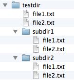
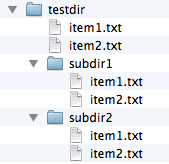

# glob-rename

A Python command line tool for global renaming of files in a single directory or directory tree.

 
 

## Sections
- [Examples](#Examples)
- [Usage](#Usage)
- [Changelog](#Changelog)

 
 

## Examples
[[back to top](#Sections)]

An example of replacing all instances of a string 'file' by another string 'item' in all .txt files in a directory tree:

	./glob-rename.py testdir/ -s item -r file -w
	Checked 8 items and renamed 6 files(s) of item

### before:

### after:

 
 

Using the `-p` (`--print`) flag, `glob-rename.py` prints out the files that it would rename instead of actually renaming them.
<pre> 
./glob-rename.py testdir/ -w -p -s file -r test

testdir/file1.txt --> testdir/test1.txt
testdir/file2.txt --> testdir/test2.txt
testdir/subdir1/file1.txt --> testdir/subdir1/test1.txt
testdir/subdir1/file2.txt --> testdir/subdir1/test2.txt
testdir/subdir2/file1.txt --> testdir/subdir2/test1.txt
testdir/subdir2/file2.txt --> testdir/subdir2/test2.txt
Checked 8 items and would rename 6 files(s).</pre>

 
 

## Usage
[[back to top](#Sections)]

An overview of all command line arguments.

<pre>./glob-rename.py -h
usage: glob-rename.py [-h] [-s SEARCH] [-r REPLACE] [-w] [-e EXTENSIONS] [-p]
                      [-v]
                      start_dir

A command line tool for global renaming of files.

positional arguments:
  start_dir

optional arguments:
  -h, --help            show this help message and exit
  -s SEARCH, --search SEARCH
                        String to be replaced.
  -r REPLACE, --replace REPLACE
                        String to replace the search query with.
  -w, --walk            Applies the global replacement recursively to sub-directorires.
  -e EXTENSIONS, --extensions EXTENSIONS
                        Only process files with particular extensions. Comma separated, e.g., ".txt,.py"
  -p, --print           Prints what it would rename.
  -v, --version         show program's version number and exit</pre>

 
 

## Changelog
[[back to top](#Sections)]

### v1.1
- Adding the optional `-p` (`--print`) flag to  print out the files that `glob-rename.py` would rename instead of actually renaming them.
