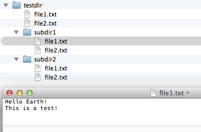

# glob-replace

A Python command line tool for global replacements of strings in text-formatted files in a single directory or directory tree.

 
 

## Sections
- [Examples](#examples)
- [Usage](#usage)
- [Changelog](#changelog)

 
 

## Examples
[[back to top](#sections)]

An example of replacing all instances of a string 'World' by another string 'Earth' in all .txt files in a directory tree:

	./glob-replace.py ./testdir -s World -r Earth -e .txt -w
	Searched 6 file(s) and replaced 6 instance(s) of World

 
 

The optional `-p` (`--print`) flag can be used to  print out the number of replacements that `glob-replace.py` would make instead of actually replacing those strings.

	./glob-replace.py testdir -w -p -s Hello -r Hi
	Searched 6 file(s) and would replace 6 instance(s) of Hello

 
 

## Usage
[[back to top](#sections)]

An overview of all command line arguments.

<pre>./glob-replace.py -h
usage: glob-replace.py [-h] [-s SEARCH] [-r REPLACE] [-w] [-e EXTENSIONS] [-p]
                       [-v]
                       start_dir

A command line tool for global replacements of strings in files.

positional arguments:
  start_dir

optional arguments:
  -h, --help            show this help message and exit
  -s SEARCH, --search SEARCH
                        String to be replaced.
  -r REPLACE, --replace REPLACE
                        String to replace the search query with.
  -f REPLACE_FROM_FILE, --replace_from_file REPLACE_FROM_FILE
                      Link to a text file that contains the text to replace the query with
  -w, --walk            Applies the global replacement recursively to sub-directorires.
  -e EXTENSIONS, --extensions EXTENSIONS
                        Only process files with particular extensions. Comma separated, e.g., ".txt,.py"
  -b, --skip_binary     Skips binary files if enabled (may result in false 
                        positives and negatives).
  -p, --print           Prints what it would rename.
  -v, --version         show program's version number and exit</pre>

 
 

## Changelog
[[back to top](#sections)]

### v1.3
- Adds an option to read the string that is used for replacement from an external text file.

### v1.2
- Adds an optional `-b` (`--skip_binary`) flag to skip binary files.

### v1.1
- Adds an optional `-p` (`--print`) flag to  print out the number of replacements that `glob-replace.py` would make instead of actually replacing those strings.